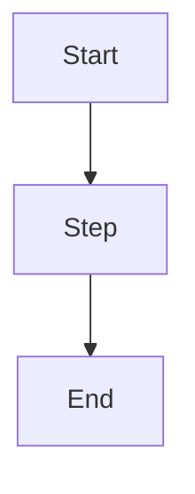

# Generic Work-Wiki Bootstrap Agent File

This file is meant to be handed to an agent to create a local-first, Obsidian-compatible work wiki. The wiki pattern is optimized for fast raw capture, agent-assisted digestion, durable project knowledge, provenance, and recurring skills.

Use this as a bootstrap instruction file, not as project knowledge. Edit the configuration first, then ask the agent to execute the bootstrap workflow.

## Configuration

Edit this section before running the bootstrap. Leave unknown fields as `unknown`; do not let the agent invent values.

```yaml
wiki_name: "work-wiki"
target_path: "./work-wiki"
owner_name: "unknown"
owner_role: "unknown"
organization: "unknown"
primary_projects: []
timezone: "unknown"
default_date_format: "YYYY-MM-DD"
vault_style: "local-first Obsidian-compatible Markdown"
knowledge_model: "raw source notes -> durable wiki pages -> generated artifacts"

purpose: >
  Maintain a durable work memory for onboarding, project context, technical
  discoveries, workflow analysis, architecture decisions, implementation notes,
  risks, tasks, and learnings.

privacy_policy:
  raw_notes_are_immutable: true
  do_not_invent_sensitive_information: true
  keep_sensitive_context_inside_vault: true
  redact_or_avoid_secrets: true

source_inputs:
  seed_raw_notes: []
  seed_reference_files: []
  seed_repositories: []
  seed_meeting_notes: []

wiki_domains:
  - context
  - people
  - projects
  - product
  - workflows
  - architecture
  - frontend
  - backend
  - integrations
  - infrastructure
  - data
  - agents
  - decisions
  - glossary
  - open-questions
  - tasks
  - risks
  - learnings

core_skills:
  digest_raw_notes: true
  daily_brief: true
  prepare_meeting: true
  lint_wiki: true
  map_codebase: true
  bootstrap_work_wiki: true

agent_preferences:
  style: "clear, technical, compact"
  provenance_required: true
  use_obsidian_links: true
  prefer_short_durable_pages: true
  append_operation_log: true
  update_index_for_important_pages: true
```

## Agent Task

Create or update the target path as a generic work wiki using the configuration above.

The finished wiki must let a user:

1. Capture messy source material under `raw/`.
2. Ask an agent to digest source material into durable pages under `wiki/`.
3. Generate daily briefs, reports, reviews, diagrams, and summaries under `generated/`.
4. Use project-local skills under `skills/` through `.agents/skills`.
5. Navigate the vault through `index.md`.
6. Audit all major operations through `log.md`.

Do not create fake project facts. Use placeholders marked `unknown` or `TODO` when the user has not provided enough information.

## Non-Negotiable Rules

- Never delete files under `raw/`.
- Never destructively rewrite files under `raw/`.
- Do not invent facts.
- Mark uncertain information clearly.
- Prefer short, durable pages over long essays.
- Use Obsidian wiki links for internal links.
- Add YAML frontmatter to every Markdown file under `wiki/`.
- Every important claim should include provenance pointing back to raw notes, meetings, files, repositories, or explicit user-provided sources.
- Update `index.md` after creating or substantially changing important pages.
- Append an entry to `log.md` after every ingest, digest, lint, bootstrap, or major query.
- Extract durable decisions into `wiki/decisions/`.
- Extract open questions into `wiki/open-questions/`.
- Extract reusable terminology into `wiki/glossary/`.
- Extract action items into `wiki/tasks/`.
- Extract risks into `wiki/risks/`.
- Extract durable lessons into `wiki/learnings/`.
- Preserve history. When information changes, mark older claims as superseded instead of deleting them.

## Target Structure

Create this structure. Keep `.gitkeep` files in empty directories.

```text
work-wiki/
  AGENTS.md
  README.md
  index.md
  log.md
  .gitignore
  .agents/
    skills -> ../skills
  raw/
    daily/
      .gitkeep
    meetings/
      .gitkeep
    project-notes/
      .gitkeep
    references/
      .gitkeep
    screenshots/
      .gitkeep
    clips/
      .gitkeep
  wiki/
    context/
      work-context.md
    people/
      .gitkeep
    projects/
      project-overview.md
    product/
      product-overview.md
    workflows/
      workflow-overview.md
    architecture/
      architecture-overview.md
    frontend/
      frontend-overview.md
    backend/
      backend-overview.md
    integrations/
      integrations-overview.md
    infrastructure/
      infrastructure-overview.md
    data/
      data-overview.md
    agents/
      principles.md
    decisions/
      ADR-0001-work-wiki.md
    glossary/
      work-wiki.md
    open-questions/
      onboarding-questions.md
    tasks/
      follow-ups.md
    risks/
      project-risks.md
    learnings/
      technical-learnings.md
  generated/
    daily-briefs/
      .gitkeep
    weekly-summaries/
      .gitkeep
    onboarding-briefs/
      .gitkeep
    reports/
      .gitkeep
    reviews/
      .gitkeep
    diagrams/
      .gitkeep
  templates/
    concept.md
    daily-note.md
    decision-adr.md
    digest-report.md
    learning.md
    meeting-note.md
    open-question.md
    risk.md
    system.md
    task.md
    workflow.md
  skills/
    digest-raw-notes/
      SKILL.md
    daily-brief/
      SKILL.md
    prepare-meeting/
      SKILL.md
    lint-wiki/
      SKILL.md
    map-codebase/
      SKILL.md
    bootstrap-work-wiki/
      SKILL.md
```

If symlinks are not supported, create `.agents/skills/README.md` that explains the environment should point agent skill discovery at `skills/`.

## Bootstrap Workflow

1. Parse the configuration.
2. If `target_path` exists, inspect it before writing. Do not overwrite unrelated files. If it already looks like a work wiki, update only missing bootstrap pieces.
3. Create the directory structure.
4. Create `AGENTS.md` from the agent instruction template below.
5. Create `README.md`, `index.md`, and `log.md`.
6. Create the template pack under `templates/`.
7. Create seed wiki pages under `wiki/` with required frontmatter and explicit uncertainty where needed.
8. Create core skills under `skills/`.
9. Create `.agents/skills` as a symlink to `../skills` when possible.
10. If the user provided seed raw notes or references, copy them into the appropriate `raw/` folders without altering the content.
11. If the user provided repositories to map, do not inspect or document them during bootstrap unless explicitly asked. Record them as follow-up tasks.
12. Verify the result with the checklist at the end of this document.
13. Return a concise changelog, including files created, assumptions left as unknown, and suggested first prompts.

## Required Frontmatter

Every Markdown file under `wiki/` must include at least:

```yaml
---
type: concept
title: ""
description: ""
tags: []
timestamp: YYYY-MM-DDTHH:mm:ss-03:00
status: draft
confidence: low
source_count: 0
related: []
---
```

Replace the example timestamp offset with the configured user's actual timezone offset.

Allowed `type` values:

- context
- person
- project
- product
- concept
- workflow
- system
- architecture
- frontend
- backend
- integration
- infrastructure
- data
- agent
- decision
- glossary
- open-question
- task
- risk
- learning
- report

Allowed `status` values:

- draft
- evolving
- stable
- superseded
- archived

Allowed `confidence` values:

- low
- medium
- high

## Seed File Specifications

### AGENTS.md

Create `AGENTS.md` with the local rules for the new vault. Use the configured owner and organization only if supplied; otherwise keep those fields generic.

````markdown
# AGENTS.md

You are maintaining this work wiki.

## Purpose

This repository is a local-first, Obsidian-compatible, agent-maintained work wiki for documenting onboarding, project context, technical discoveries, workflow analysis, architecture decisions, implementation notes, risks, tasks, and learnings.

## Core model

- `raw/` contains immutable source notes.
- `wiki/` contains durable, agent-maintained knowledge.
- `generated/` contains summaries, briefs, reports, diagrams, reviews, and derived artifacts.
- `templates/` contains copy-ready note and wiki templates.
- `skills/` contains Codex-style skill folders for recurring agent workflows.
- `.agents/skills` points to `skills/` so compatible agents can discover repo-scoped skills.
- `index.md` is the main navigation map.
- `log.md` is an append-only chronological record of wiki operations.

## Non-negotiable rules

- Never delete files under `raw/`.
- Never destructively rewrite files under `raw/`.
- Do not invent facts.
- Mark uncertain information clearly.
- Prefer short, durable pages over long essays.
- Use Obsidian wiki links for internal links.
- Add YAML frontmatter to every Markdown file under `wiki/`.
- Every important claim should include provenance pointing back to one or more raw notes, meetings, files, repositories, or explicit user-provided sources.
- Update `index.md` after creating or substantially changing important pages.
- Append an entry to `log.md` after every ingest, digest, lint, bootstrap, or major query.
- Preserve history by marking older claims as superseded instead of deleting them.

## Knowledge standards

When updating wiki pages, distinguish clearly between:

- Fact: directly supported by raw notes or explicit sources.
- Assumption: plausible but not confirmed.
- Inference: reasoned interpretation based on available information.
- Question: unknown that needs follow-up.
- Decision: agreed direction or explicit choice.
- Risk: something that may negatively affect the work.
- Task: action that should be completed.

## Workflows

- Use `skills/digest-raw-notes/SKILL.md` to digest raw notes into durable wiki updates.
- Use `skills/daily-brief/SKILL.md` to prepare a morning brief.
- Use `skills/prepare-meeting/SKILL.md` before calls, onboarding sessions, reviews, or project syncs.
- Use `skills/lint-wiki/SKILL.md` to review wiki hygiene before cleanup.
- Use `skills/map-codebase/SKILL.md` after repository access is available.
- Use `skills/bootstrap-work-wiki/SKILL.md` to create or adapt another work wiki.

## Writing style

- Clear, technical, compact.
- Avoid filler.
- Use tables only when they improve clarity.
- Use Mermaid diagrams when helpful.
- Use concrete file paths when referencing sources.
- Distinguish fact, assumption, inference, question, decision, risk, and task.
````

### README.md

Create a concise README:

````markdown
# Work Wiki

This vault is a local-first, Obsidian-compatible work memory system.

Use `raw/` for fast notes and source material. Keep raw notes messy and complete. Agents must not destructively rewrite them.

Use `wiki/` for durable synthesized knowledge. These pages are written for future readers and future agents.

Use `generated/` for briefs, reports, summaries, diagrams, and reviews.

Use `skills/` for repeatable agent workflows. Compatible agents can discover them through `.agents/skills`.

## Daily loop

1. Write raw notes.
2. Ask an agent to digest recent notes.
3. Review generated changes.
4. Commit the vault.

## Suggested prompts

- "Digest today's notes."
- "Give me a daily brief."
- "Prepare me for this meeting."
- "Find stale assumptions or contradictions."
- "Map this repository into the wiki."
````

### index.md

Create `index.md` as the navigation map. Include links to every seed page and the core skills.

````markdown
# Work Wiki Index

## Current focus

- [[wiki/context/work-context|Work context]]
- [[wiki/projects/project-overview|Project overview]]
- [[wiki/tasks/follow-ups|Follow-ups]]
- [[wiki/open-questions/onboarding-questions|Open questions]]

## Knowledge areas

- [[wiki/context/work-context|Context]]
- [[wiki/people/|People]]
- [[wiki/projects/project-overview|Projects]]
- [[wiki/product/product-overview|Product]]
- [[wiki/workflows/workflow-overview|Workflows]]
- [[wiki/architecture/architecture-overview|Architecture]]
- [[wiki/frontend/frontend-overview|Frontend]]
- [[wiki/backend/backend-overview|Backend]]
- [[wiki/integrations/integrations-overview|Integrations]]
- [[wiki/infrastructure/infrastructure-overview|Infrastructure]]
- [[wiki/data/data-overview|Data]]
- [[wiki/agents/principles|Agents]]

## Operating records

- [[wiki/decisions/ADR-0001-work-wiki|ADR-0001: Use a work wiki]]
- [[wiki/glossary/work-wiki|Work wiki]]
- [[wiki/open-questions/onboarding-questions|Open questions]]
- [[wiki/tasks/follow-ups|Follow-ups]]
- [[wiki/risks/project-risks|Project risks]]
- [[wiki/learnings/technical-learnings|Technical learnings]]

## Skills

- [[skills/digest-raw-notes/SKILL|digest-raw-notes]]
- [[skills/daily-brief/SKILL|daily-brief]]
- [[skills/prepare-meeting/SKILL|prepare-meeting]]
- [[skills/lint-wiki/SKILL|lint-wiki]]
- [[skills/map-codebase/SKILL|map-codebase]]
- [[skills/bootstrap-work-wiki/SKILL|bootstrap-work-wiki]]
````

### log.md

Create `log.md` as append-only:

````markdown
# Wiki Operations Log

This file is append-only. Add entries after every ingest, digest, lint, bootstrap, or major query.

## YYYY-MM-DDTHH:mm:ss-03:00 - Bootstrap

- Created initial work wiki structure.
- Added agent operating instructions, navigation, templates, seed wiki pages, generated folders, and core skills.
- Source: user-provided bootstrap configuration.
````

## Template Pack

Create these files under `templates/`.

### templates/daily-note.md

````markdown
# Daily Note - YYYY-MM-DD

## Raw notes

## People / teams mentioned

## Systems / tools mentioned

## Workflows mentioned

## Technical discoveries

## Decisions

## Open questions

## Follow-ups

## Risks

## Terms to define

## Links / references
````

### templates/meeting-note.md

````markdown
# Meeting - YYYY-MM-DD - Title

## Context

## Attendees

## Raw notes

## Decisions

## Open questions

## Follow-ups

## Risks

## Source / links
````

### templates/concept.md

````markdown
---
type: concept
title: ""
description: ""
tags: []
timestamp: YYYY-MM-DDTHH:mm:ss-03:00
status: draft
confidence: low
source_count: 0
related: []
---

# {{title}}

## Definition

## Current understanding

## Why it matters

## Source/provenance

## Related
````

### templates/system.md

````markdown
---
type: system
title: ""
description: ""
tags: []
timestamp: YYYY-MM-DDTHH:mm:ss-03:00
status: draft
confidence: low
source_count: 0
related: []
---

# {{title}}

## Purpose

## Current understanding

## Components

## Inputs

## Outputs

## Dependencies

## Owners

## Risks

## Open questions

## Source/provenance
````

### templates/workflow.md

````markdown
---
type: workflow
title: ""
description: ""
tags: []
timestamp: YYYY-MM-DDTHH:mm:ss-03:00
status: draft
confidence: low
source_count: 0
related: []
---

# {{title}}

## Purpose

## Current workflow

## Pain points

## Inputs

## Outputs

## Actors

## Systems involved

## Automation opportunities

## Agentic opportunities

## Open questions

## Source/provenance

## Mermaid placeholder diagram


````

### templates/decision-adr.md

````markdown
---
type: decision
title: ""
description: ""
tags: []
timestamp: YYYY-MM-DDTHH:mm:ss-03:00
status: draft
confidence: low
source_count: 0
related: []
---

# ADR - {{title}}

## Status

## Context

## Decision

## Consequences

## Alternatives considered

## Source/provenance
````

### templates/open-question.md

````markdown
---
type: open-question
title: ""
description: ""
tags: []
timestamp: YYYY-MM-DDTHH:mm:ss-03:00
status: draft
confidence: low
source_count: 0
related: []
---

# {{title}}

## Question

## Why it matters

## Current assumption

## How to answer

## Owner

## Status

## Source/provenance
````

### templates/task.md

````markdown
---
type: task
title: ""
description: ""
tags: []
timestamp: YYYY-MM-DDTHH:mm:ss-03:00
status: draft
confidence: low
source_count: 0
related: []
---

# {{title}}

## Task

## Context

## Definition of done

## Priority

## Owner

## Status

## Source/provenance
````

### templates/risk.md

````markdown
---
type: risk
title: ""
description: ""
tags: []
timestamp: YYYY-MM-DDTHH:mm:ss-03:00
status: draft
confidence: low
source_count: 0
related: []
---

# {{title}}

## Risk

## Impact

## Likelihood

## Mitigation

## Signals to watch

## Owner

## Status

## Source/provenance
````

### templates/learning.md

````markdown
---
type: learning
title: ""
description: ""
tags: []
timestamp: YYYY-MM-DDTHH:mm:ss-03:00
status: draft
confidence: low
source_count: 0
related: []
---

# {{title}}

## Learning

## Context

## Why it matters

## How to apply it

## Related concepts

## Source/provenance
````

### templates/digest-report.md

````markdown
# Digest Report - YYYY-MM-DD

## Digest date

## Sources reviewed

## Pages created

## Pages updated

## Decisions extracted

## Open questions extracted

## Tasks extracted

## Risks extracted

## Learnings extracted

## Possible contradictions

## Suggested next steps
````

## Core Skill Pack

Create each skill as a folder containing `SKILL.md`.

### skills/digest-raw-notes/SKILL.md

````markdown
---
name: digest-raw-notes
description: "Digest messy work-wiki raw notes into durable wiki updates. Use when the user asks to digest today's notes, process meeting notes, ingest raw notes, extract decisions/questions/tasks/risks/terms/systems/workflows, or update the wiki from files under raw/."
---

# Digest Raw Notes

Use this skill to turn messy source notes into durable work-wiki knowledge.

## Inputs

- Start with `AGENTS.md` and `index.md`.
- Read newest relevant files under `raw/`, especially `raw/daily/`, `raw/meetings/`, `raw/project-notes/`, `raw/clips/`, and `raw/references/`.
- Prefer notes changed since the last digest entry in `log.md`.
- Read existing related pages under `wiki/` before creating new pages.

## Workflow

1. Build a source list with file paths and dates.
2. Extract facts, decisions, open questions, tasks, risks, terms, systems, and workflows.
3. Compare extracted items against existing `wiki/` pages.
4. Update existing pages when the concept already exists.
5. Create new pages only for durable concepts, using `templates/`.
6. Put decisions in `wiki/decisions/`, open questions in `wiki/open-questions/`, tasks in `wiki/tasks/`, risks in `wiki/risks/`, terms in `wiki/glossary/`, systems in the closest system category, and workflows in `wiki/workflows/`.
7. Add YAML frontmatter to every new or edited `wiki/*.md` page using `AGENTS.md`.
8. Add source/provenance sections with concrete source paths.
9. Update `index.md` when important pages are created or substantially changed.
10. Write a digest report to `generated/reports/digest-YYYY-MM-DD.md`.
11. Append an operation entry to `log.md`.
12. Return a concise changelog.

## Safety

- Never delete or destructively rewrite raw notes.
- Do not invent facts.
- Mark uncertainty as assumption, inference, or question.
````

### skills/daily-brief/SKILL.md

````markdown
---
name: daily-brief
description: "Prepare a morning work-wiki brief from recent raw notes and wiki state. Use when the user asks for a daily brief, morning brief, what happened yesterday, what they learned, what is unclear, what to ask today, or pending follow-ups."
---

# Daily Brief

Use this skill before starting work for the day.

## Inputs

- Start with `AGENTS.md`, `index.md`, and latest entries in `log.md`.
- Read yesterday's and recent files under `raw/daily/` and `raw/meetings/`.
- Read relevant pages under `wiki/open-questions/`, `wiki/tasks/`, `wiki/risks/`, `wiki/decisions/`, `wiki/learnings/`, and active project/context pages.
- If available, read recent files under `generated/daily-briefs/` and `generated/reports/`.

## Output

Write the brief to `generated/daily-briefs/YYYY-MM-DD.md` unless the user asks for inline-only output.

## Required sections

- `# Daily Brief - YYYY-MM-DD`
- `## Sources reviewed`
- `## What happened yesterday?`
- `## What did I learn?`
- `## What is still unclear?`
- `## What should I ask today?`
- `## Pending follow-ups`
- `## Risks to watch`
- `## Suggested focus`

## Safety

- Do not rewrite raw notes.
- Do not mark questions as answered unless a source clearly answers them.
- Do not invent meetings, stakeholders, repositories, tools, or project facts.
````

### skills/prepare-meeting/SKILL.md

````markdown
---
name: prepare-meeting
description: "Prepare meeting context from the work wiki. Use before calls, onboarding sessions, client meetings, project syncs, technical reviews, architecture discussions, or any request to prepare questions, talking points, risks, or decisions for a meeting."
---

# Prepare Meeting

Use this skill to generate a concise meeting prep brief.

## Inputs

- Start with `AGENTS.md` and `index.md`.
- Identify the meeting topic, project, system, people, and date from the user request or available notes.
- Read relevant pages under `wiki/`.
- Read relevant raw notes under `raw/daily/`, `raw/meetings/`, `raw/project-notes/`, and `raw/references/`.
- Read relevant generated briefs or reports if they are newer than wiki pages.

If the meeting target cannot be inferred, ask one concise question.

## Output

If the user asks for a reusable artifact, write to `generated/reports/meeting-prep-YYYY-MM-DD-slug.md`; otherwise answer inline. Append to `log.md` when a file is created.

## Required sections

- `# Meeting Prep - YYYY-MM-DD - Title`
- `## Sources reviewed`
- `## Current understanding`
- `## Relevant notes`
- `## Open questions`
- `## Risks`
- `## Suggested talking points`
- `## Decisions that may be needed`
- `## Follow-ups to confirm`
````

### skills/lint-wiki/SKILL.md

````markdown
---
name: lint-wiki
description: "Review the work wiki for knowledge hygiene. Use weekly or when asked to lint the wiki, find duplicate pages, stale assumptions, contradictions, missing provenance, orphan pages, old tasks, or answered open questions."
---

# Lint Wiki

Use this skill to keep the vault reliable as it grows.

## Inputs

- Start with `AGENTS.md`, `index.md`, and `log.md`.
- Inspect Markdown files under `wiki/`.
- Inspect `generated/` only when needed.
- Inspect `raw/` only as provenance when validating important claims.

## Output

First produce a review report. Do not change wiki content during the initial lint pass. Write the report to `generated/reviews/wiki-lint-YYYY-MM-DD.md` and append to `log.md`.

## Required checks

- Duplicate or overlapping pages.
- Stale assumptions.
- Contradictions.
- Missing or weak provenance.
- Orphan pages not linked from `index.md` or related pages.
- Old tasks.
- Open questions that appear answered by later notes.
- Wiki pages missing required YAML frontmatter fields.
- Broken or suspicious Obsidian links.
````

### skills/map-codebase/SKILL.md

````markdown
---
name: map-codebase
description: "Map a software repository into the work wiki. Use after repo access is available when asked to document a codebase, inspect a repo, identify stack, entry points, architecture, frontend/backend structure, APIs, integrations, env setup, build/test/deploy commands, or conventions."
---

# Map Codebase

Use this skill once the user has access to a repository that should be documented in the work wiki.

## Inputs

- Start with `AGENTS.md`, `index.md`, and relevant project pages.
- Identify the target repository path from the user request or current working directory.
- Inspect source files, manifests, configs, docs, scripts, CI files, Docker files, and environment examples.
- Do not read or expose secrets from real `.env` files. Prefer `.env.example`, docs, and config schemas.

## Outputs

- Update or create durable pages under relevant `wiki/` directories.
- Write a mapping report to `generated/reports/codebase-map-YYYY-MM-DD-repo-slug.md`.
- Append an operation entry to `log.md`.

## Capture

- Stack and major dependencies.
- Entrypoints and runtime processes.
- Architecture and module boundaries.
- Frontend and backend structure.
- APIs, routes, jobs, queues, or scheduled tasks.
- Integrations and external services.
- Environment setup and required configuration.
- Build, test, lint, and deploy commands.
- Important conventions and patterns.
- Known risks, TODOs, and unclear areas.
````

### skills/bootstrap-work-wiki/SKILL.md

````markdown
---
name: bootstrap-work-wiki
description: "Create or adapt a local-first Obsidian-compatible work wiki with raw/wiki/generated/templates/skills structure. Use whenever the user asks to bootstrap, scaffold, clone, configure, personalize, or make a work wiki, project memory vault, agent-maintained knowledge base, or Obsidian work vault."
---

# Bootstrap Work Wiki

Use this skill to create a work wiki for a user or project.

## Interview

Ask for missing configuration in one compact numbered block:

1. Target path and wiki name.
2. Owner name, role, organization, and timezone.
3. Current project or domain focus.
4. Starting raw notes, meeting notes, references, screenshots, or repositories.
5. Privacy constraints and sources that must not be copied.
6. Which core skills to install.
7. Whether to create an Obsidian-ready vault and `.agents/skills` symlink.
8. The first useful output after bootstrap: digest, daily brief, onboarding brief, or codebase map.

If the user has already supplied enough context, infer the configuration and continue. Use `unknown` for anything not supplied.

## Build workflow

1. Create the configured folder structure.
2. Create `AGENTS.md`, `README.md`, `index.md`, `log.md`, `templates/`, and core `skills/`.
3. Create seed pages under `wiki/` with required frontmatter.
4. Copy user-provided source material into `raw/` without rewriting it.
5. Update `index.md`.
6. Append a bootstrap entry to `log.md`.
7. Verify structure, frontmatter, skill discovery, and generated folders.
8. Return a concise changelog and recommended first prompts.

## Safety

- Never delete or rewrite raw notes.
- Do not invent project facts.
- Preserve existing files in non-empty targets.
- Mark uncertainty as `unknown`, assumption, inference, or question.
````

## Seed Wiki Pages

Create seed pages that are useful but honest. Use `unknown` where needed.

Minimum seed pages:

- `wiki/context/work-context.md`: owner role, organization, current focus, and unknowns.
- `wiki/projects/project-overview.md`: known projects and project questions.
- `wiki/product/product-overview.md`: product context if known, otherwise unknown.
- `wiki/workflows/workflow-overview.md`: current work loops and unknown handoffs.
- `wiki/architecture/architecture-overview.md`: architecture knowns and unknowns.
- `wiki/frontend/frontend-overview.md`: frontend knowns and unknowns.
- `wiki/backend/backend-overview.md`: backend knowns and unknowns.
- `wiki/integrations/integrations-overview.md`: tool and service integrations.
- `wiki/infrastructure/infrastructure-overview.md`: environments, hosting, deployment unknowns.
- `wiki/data/data-overview.md`: stores, models, ownership, and unknowns.
- `wiki/agents/principles.md`: agent operating principles for the vault.
- `wiki/decisions/ADR-0001-work-wiki.md`: decision to use a local work wiki.
- `wiki/glossary/work-wiki.md`: definition of the work wiki pattern.
- `wiki/open-questions/onboarding-questions.md`: starter questions.
- `wiki/tasks/follow-ups.md`: starter follow-ups.
- `wiki/risks/project-risks.md`: starter risks.
- `wiki/learnings/technical-learnings.md`: starter learning log.

Every seed page should cite `Source/provenance: user-provided bootstrap configuration` unless it was created from a concrete raw source file.

## Verification Checklist

Before finishing, verify:

- `AGENTS.md`, `README.md`, `index.md`, and `log.md` exist.
- `raw/`, `wiki/`, `generated/`, `templates/`, and `skills/` exist.
- Empty directories contain `.gitkeep`.
- `.agents/skills` points to `skills/`, or a fallback README explains skill discovery.
- Every Markdown page under `wiki/` has required frontmatter.
- Core skills each have a `SKILL.md` with `name` and `description` frontmatter.
- `index.md` links to seed wiki pages and core skills.
- `log.md` contains the bootstrap entry.
- No raw notes were rewritten.
- No project-specific facts were invented.

## Suggested First Prompts

After bootstrap, suggest these prompts to the user:

- "Digest today's notes."
- "Create an onboarding brief from what is currently in the vault."
- "Prepare me for my next meeting."
- "Lint the wiki for missing provenance and stale assumptions."
- "Map this repository into the wiki."
